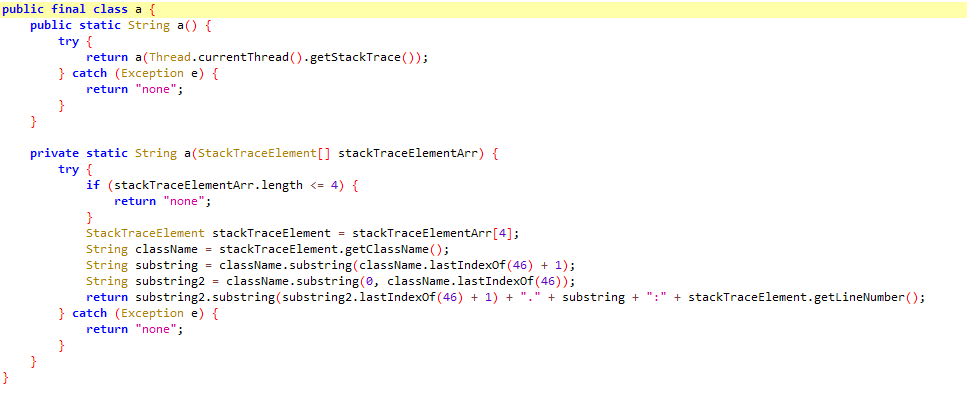
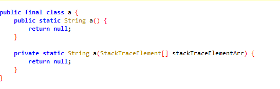
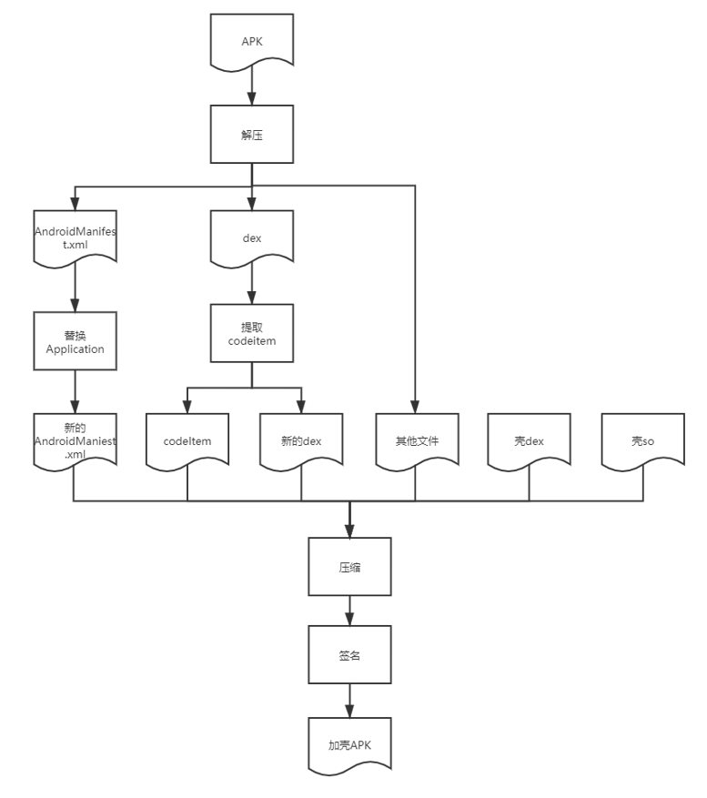
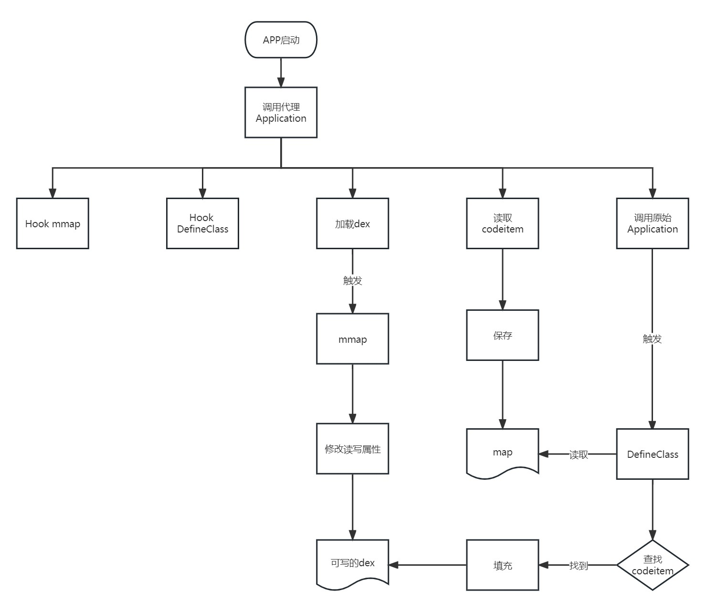
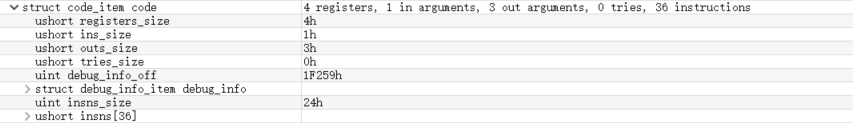

## 0x0 Preface
The term "function extraction shell" (函数抽取壳) isn't clear in its origin, but I understand it as a type of shell that removes (NOPs) the function code in a DEX file and then restores the bytecode at runtime.

Before function extraction:


After function extraction:


## 0x1 Project Structure

The DPT code is divided into two parts: **Processor** and **Shell**.

### Processor
This module processes a regular APK into a protected (shelled) APK. Its main functions are:
- Unzip the APK
- Extract and save the CodeItem from the APK's DEX file
- Modify the Application class name in AndroidManifest.xml
- Generate a new APK

**Processor Workflow:**


### Shell
This module generates DEX and SO files that are integrated into the APK to be protected. Its main functions are:
- Handle App startup
- Replace dexElements
- Hook related functions
- Call the target Application
- Read CodeItem files
- Restore CodeItem

**Shell Workflow:**


## 0x2 Processor

The processor has two key tasks: handling the **AndroidManifest.xml** and extracting the **CodeItem**.

### (1) Handling AndroidManifest.xml

The main operations for AndroidManifest.xml are:
- **Backup** the original Application class name to call it after the shell process is complete.
- **Replace** it with the shell’s proxy Application class name to start the proxy Application early during app launch. This allows preparatory work like custom DEX loading and function hooking.

AndroidManifest.xml in an APK is stored in **AXML** format, not plain XML. Fortunately, existing libraries like [ManifestEditor](https://github.com/WindySha/ManifestEditor) handle AXML parsing and editing, so we can use them directly.

**Code to extract the original Application class name:**
- Use the `getApplicationName` function to retrieve the class name.

```java
public static String getValue(String file, String tag, String ns, String attrName) {
    byte[] axmlData = IoUtils.readFile(file);
    AxmlParser axmlParser = new AxmlParser(axmlData);
    try {
        while (axmlParser.next() != AxmlParser.END_FILE) {
            if (axmlParser.getAttrCount() != 0 && !axmlParser.getName().equals(tag)) {
                continue;
            }
            for (int i = 0; i < axmlParser.getAttrCount(); i++) {
                if (axmlParser.getNamespacePrefix().equals(ns) && axmlParser.getAttrName(i).equals(attrName)) {
                    return (String) axmlParser.getAttrValue(i);
                }
            }
        }
    } catch (Exception e) {
        e.printStackTrace();
    }
    return null;
}

public static String getApplicationName(String file) {
    return getValue(file, "application", "android", "name");
}
```

**Code to write the proxy Application class name:**
- Updates the AndroidManifest.xml with the new Application class name.

```java
public static void writeApplicationName(String inManifestFile, String outManifestFile, String newApplicationName) {
    ModificationProperty property = new ModificationProperty();
    property.addApplicationAttribute(new AttributeItem(NodeValue.Application.NAME, newApplicationName));
    FileProcesser.processManifestFile(inManifestFile, outManifestFile, property);
}
```

### (2) Extracting CodeItem

The **CodeItem** is a structure in the DEX file that holds function bytecode data. The image below shows its approximate structure:



Extracting the CodeItem actually means extracting the **insns** (instructions) field, which contains the actual function bytecode. We use the **dx** tool from Android's source code ([dx](https://android.googlesource.com/platform/dalvik/+/refs/heads/master/dx/)) to easily read various parts of the DEX file.

**Code to extract all methods:**
- Iterates through all **ClassDef** entries in the DEX file, processes their methods, and calls `extractMethod` for each.

```java
public static List<Instruction> extractAllMethods(File dexFile, File outDexFile) {
    List<Instruction> instructionList = new ArrayList<>();
    Dex dex = null;
    RandomAccessFile randomAccessFile = null;
    byte[] dexData = IoUtils.readFile(dexFile.getAbsolutePath());
    IoUtils.writeFile(outDexFile.getAbsolutePath(), dexData);

    try {
        dex = new Dex(dexFile);
        randomAccessFile = new RandomAccessFile(outDexFile, "rw");
        Iterable<ClassDef> classDefs = dex.classDefs();
        for (ClassDef classDef : classDefs) {
            if (classDef.getClassDataOffset() == 0) {
                String log = String.format("class '%s' data offset is zero", classDef.toString());
                logger.warn(log);
                continue;
            }
            ClassData classData = dex.readClassData(classDef);
            ClassData.Method[] directMethods = classData.getDirectMethods();
            ClassData.Method[] virtualMethods = classData.getVirtualMethods();
            for (ClassData.Method method : directMethods) {
                Instruction instruction = extractMethod(dex, randomAccessFile, classDef, method);
                if (instruction != null) {
                    instructionList.add(instruction);
                }
            }
            for (ClassData.Method method : virtualMethods) {
                Instruction instruction = extractMethod(dex, randomAccessFile, classDef, method);
                if (instruction != null) {
                    instructionList.add(instruction);
                }
            }
        }
    } catch (Exception e) {
        e.printStackTrace();
    } finally {
        IoUtils.close(randomAccessFile);
    }
    return instructionList;
}
```

**Code to extract a single method:**
- Skips methods with no code (e.g., native or abstract methods) or those with insufficient **insns** capacity to hold a return statement.
- Extracts the bytecode, replaces it with **NOP** instructions in the DEX file, and inserts a **return** statement. This is the core of the "function extraction shell" process.

```java
private static Instruction extractMethod(Dex dex, RandomAccessFile outRandomAccessFile, ClassDef classDef, ClassData.Method method) throws Exception {
    String returnTypeName = dex.typeNames().get(dex.protoIds().get(dex.methodIds().get(method.getMethodIndex()).getProtoIndex()).getReturnTypeIndex());
    String methodName = dex.strings().get(dex.methodIds().get(method.getMethodIndex()).getNameIndex());
    String className = dex.typeNames().get(classDef.getTypeIndex());
    
    // Skip native or abstract methods
    if (method.getCodeOffset() == 0) {
        String log = String.format("method code offset is zero, name = %s.%s, returnType = %s",
                TypeUtils.getHumanizeTypeName(className), methodName, TypeUtils.getHumanizeTypeName(returnTypeName));
        logger.warn(log);
        return null;
    }
    
    Instruction instruction = new Instruction();
    int insnsOffset = method.getCodeOffset() + 16; // Offset for insns
    Code code = dex.readCode(method);
    
    // Skip methods with no code
    if (code.getInstructions().length == 0) {
        String log = String.format("method has no code, name = %s.%s, returnType = %s",
                TypeUtils.getHumanizeTypeName(className), methodName, TypeUtils.getHumanizeTypeName(returnTypeName));
        logger.warn(log);
        return null;
    }
    
    int insnsCapacity = code.getInstructions().length;
    byte[] returnByteCodes = getReturnByteCodes(returnTypeName);
    
    // Skip if insns capacity is too small for return statement
    if (insnsCapacity * 2 < returnByteCodes.length) {
        logger.warn("The capacity of insns is not enough to store the return statement. {}.{}() -> {} insnsCapacity = {}byte(s), returnByteCodes = {}byte(s)",
                TypeUtils.getHumanizeTypeName(className), methodName, TypeUtils.getHumanizeTypeName(returnTypeName),
                insnsCapacity * 2, returnByteCodes.length);
        return null;
    }
    
    instruction.setOffsetOfDex(insnsOffset);
    instruction.setMethodIndex(method.getMethodIndex());
    instruction.setInstructionDataSize(insnsCapacity * 2);
    
    byte[] byteCode = new byte[insnsCapacity * 2];
    
    // Replace bytecode with NOPs
    for (int i = 0; i < insnsCapacity; i++) {
        outRandomAccessFile.seek(insnsOffset + (i * 2));
        byteCode[i * 2] = outRandomAccessFile.readByte();
        byteCode[i * 2 + 1] = outRandomAccessFile.readByte();
        outRandomAccessFile.seek(insnsOffset + (i * 2));
        outRandomAccessFile.writeShort(0); // Write NOP
    }
    
    instruction.setInstructionsData(byteCode);
    outRandomAccessFile.seek(insnsOffset);
    outRandomAccessFile.write(returnByteCodes); // Write return statement
    
    return instruction;
}
```

## 0x3 Shell Module

The **shell module** contains the core logic of the function extraction shell. Its functions were outlined earlier.

### (1) Hook Functions

Hooking should occur early. In DPT, hooks are set up when the `.init_array` section is loaded.

```cpp
__attribute__ ((constructor)) void init_dpt() {
    dpt_hook();
}
```

The hooking frameworks used are [Dobby](https://github.com/jmpews/Dobby) and [bhook](https://github.com/bytedance/bhook). Two main functions are hooked: **mmap** and **DefineClass**.

#### **mmap**

The purpose of hooking **mmap** is to modify the DEX file's properties during loading to make it writable, allowing bytecode restoration. For detailed analysis, see [this article](https://bbs.pediy.com/thread-266527.htm).

**Hook mmap code:**

```cpp
bytehook_stub_t stub = bytehook_hook_single(
        getArtLibName(),
        "libc.so",
        "mmap",
        (void*)fake_mmap,
        nullptr,
        nullptr);
if (stub != nullptr) {
    DLOGD("mmap hook success!");
}
```

After hooking, the `__prot` parameter is modified to add the **PROT_WRITE** attribute:

```cpp
void* fake_mmap(void* __addr, size_t __size, int __prot, int __flags, int __fd, off_t __offset) {
    BYTEHOOK_STACK_SCOPE();
    int hasRead = (__prot & PROT_READ) == PROT_READ;
    int hasWrite = (__prot & PROT_WRITE) == PROT_WRITE;
    int prot = __prot;

    if (hasRead && !hasWrite) {
        prot = prot | PROT_WRITE;
        DLOGD("fake_mmap call fd = %p, size = %d, prot = %d, flag = %d", __fd, __size, prot, __flags);
    }

    void *addr = BYTEHOOK_CALL_PREV(fake_mmap, __addr, __size, prot, __flags, __fd, __offset);
    return addr;
}
```

Here's a simplified translation for quick understanding:

#### **DefineClass**

Before hooking the **DefineClass** function, we need to understand its role and why it's chosen over other functions.

When a class is loaded, the call sequence (simplified) is:
1. `ClassLoader.java::loadClass`
2. `DexFile.java::defineClass`
3. `class_linker.cc::DefineClass`
4. `class_linker.cc::LoadClass`
5. `class_linker.cc::LoadClassMembers`
6. `class_linker.cc::LoadMethod`

The **DefineClass** function is called during class loading. Its prototype is:

```cpp
mirror::Class* ClassLinker::DefineClass(Thread* self,
                                        const char* descriptor,
                                        size_t hash,
                                        Handle<mirror::ClassLoader> class_loader,
                                        const DexFile& dex_file,
                                        const DexFile::ClassDef& dex_class_def);
```

**DefineClass** provides key information through its parameters:
- **DexFile**: Identifies which DEX file the class comes from.
- **ClassDef**: Provides the offset of the class data, helping locate and restore CodeItems.

The **ClassDef** structure is critical:

```cpp
struct ClassDef {
    uint32_t class_idx_;  // Index into type_ids_ array for this class
    uint32_t access_flags_;
    uint32_t superclass_idx_;  // Index into type_ids_ array for superclass
    uint32_t interfaces_off_;  // File offset to TypeList
    uint32_t source_file_idx_;  // Index into string_ids_ for source file name
    uint32_t annotations_off_;  // File offset to annotations_directory_item
    uint32_t class_data_off_;  // File offset to class_data_item
    uint32_t static_values_off_;  // File offset to EncodedArray
};
```

The **class_data_off_** field points to the exact offset of the class's data in the DEX file, allowing us to locate the **CodeItem** for all methods in the class.

**Hook DefineClass code:**

```cpp
void* DefineClass(void* thiz, void* self,
                 const char* descriptor,
                 size_t hash,
                 void* class_loader,
                 const void* dex_file,
                 const void* dex_class_def) {
    ...
    auto* class_def = (dex::ClassDef *)dex_class_def;
    auto *class_data = (uint8_t *)((uint8_t *)begin + class_def->class_data_off_);

    size_t read = 0;
    uint64_t static_fields_size = 0;
    read += DexFileUtils::readUleb128(class_data, &static_fields_size);

    uint64_t instance_fields_size = 0;
    read += DexFileUtils::readUleb128(class_data + read, &instance_fields_size);

    uint64_t direct_methods_size = 0;
    read += DexFileUtils::readUleb128(class_data + read, &direct_methods_size);

    uint64_t virtual_methods_size = 0;
    read += DexFileUtils::readUleb128(class_data + read, &virtual_methods_size);

    dex::ClassDataField staticFields[static_fields_size];
    read += DexFileUtils::readFields(class_data + read, staticFields, static_fields_size);

    dex::ClassDataField instanceFields[instance_fields_size];
    read += DexFileUtils::readFields(class_data + read, instanceFields, instance_fields_size);

    dex::ClassDataMethod directMethods[direct_methods_size];
    read += DexFileUtils::readMethods(class_data + read, directMethods, direct_methods_size);

    dex::ClassDataMethod virtualMethods[virtual_methods_size];
    read += DexFileUtils::readMethods(class_data + read, virtualMethods, virtual_methods_size);

    for (int i = 0; i < direct_methods_size; i++) {
        auto method = directMethods[i];
        patchMethod(begin, location.c_str(), dexSize, dexIndex, method.method_idx_delta_, method.code_off_);
    }

    for (int i = 0; i < virtual_methods_size; i++) {
        auto method = virtualMethods[i];
        patchMethod(begin, location.c_str(), dexSize, dexIndex, method.method_idx_delta_, method.code_off_);
    }
    ...
}
```

**Why hook DefineClass?**
- The **ClassDef** structure is part of the DEX file format, which is stable and unlikely to change.
- The **DefineClass** function's parameters have remained consistent since Android M, ensuring good compatibility across Android versions.

**Can other functions be hooked?**
Yes, DPT previously hooked **LoadMethod** for CodeItem restoration. However:
- **LoadMethod**'s parameters vary across Android versions, requiring frequent updates.
- Hooking **LoadMethod** requires patching each method individually, which impacts performance.

Thus, **DefineClass** is preferred for its stability and efficiency.

### (2) Loading DEX

During the processing phase, DPT moves all DEX files from the APK into a separate ZIP file, so they are not in the original APK. Thus, the DEX files must be manually loaded when the app starts.

The system loads DEX files in read-only mode, which prevents modifying their memory. To overcome this, we manually load the DEX files from the APK.

**DEX loading code:**

```java
private ClassLoader loadDex(Context context) {
    String sourcePath = context.getApplicationInfo().sourceDir;
    String nativePath = context.getApplicationInfo().nativeLibraryDir;

    ShellClassLoader shellClassLoader = new ShellClassLoader(sourcePath, nativePath, ClassLoader.getSystemClassLoader());
    return shellClassLoader;
}
```

**Custom ClassLoader:**

```java
public class ShellClassLoader extends PathClassLoader {
    private final String TAG = ShellClassLoader.class.getSimpleName();

    public ShellClassLoader(String dexPath, ClassLoader classLoader) {
        super(dexPath, classLoader);
    }

    public ShellClassLoader(String dexPath, String librarySearchPath, ClassLoader classLoader) {
        super(dexPath, librarySearchPath, classLoader);
    }
}
```

### (3) Merging dexElements

This step is critical. When loading an APK, DEX, or JAR, they are stored in memory as **Element** objects in the `dexElements` array. Merging `dexElements` ensures that the newly loaded DEX files are placed at the beginning of the array, so the ClassLoader prioritizes them when searching for classes.

**Merging dexElements code:**

```cpp
void combineDexElements(JNIEnv* env, jclass klass, jobject oldClassLoader, jobject newClassLoader) {
    jclass BaseDexClassLoaderClass = env->FindClass("dalvik/system/BaseDexClassLoader");
    jfieldID pathList = env->GetFieldID(BaseDexClassLoaderClass, "pathList", "Ldalvik/system/DexPathList;");
    jobject oldDexPathListObj = env->GetObjectField(oldClassLoader, pathList);
    if (env->ExceptionCheck() || nullptr == oldDexPathListObj) {
        env->ExceptionClear();
        return;
    }
    jobject newDexPathListObj = env->GetObjectField(newClassLoader, pathList);
    if (env->ExceptionCheck() || nullptr == newDexPathListObj) {
        env->ExceptionClear();
        return;
    }

    jclass DexPathListClass = env->FindClass("dalvik/system/DexPathList");
    jfieldID dexElementField = env->GetFieldID(DexPathListClass, "dexElements", "[Ldalvik/system/DexPathList$Element;");

    jobjectArray newClassLoaderDexElements = static_cast<jobjectArray>(env->GetObjectField(newDexPathListObj, dexElementField));
    if (env->ExceptionCheck() || nullptr == newClassLoaderDexElements) {
        env->ExceptionClear();
        return;
    }

    jobjectArray oldClassLoaderDexElements = static_cast<jobjectArray>(env->GetObjectField(oldDexPathListObj, dexElementField));
    if (env->ExceptionCheck() || nullptr == oldClassLoaderDexElements) {
        env->ExceptionClear();
        return;
    }

    jint oldLen = env->GetArrayLength(oldClassLoaderDexElements);
    jint newLen = env->GetArrayLength(newClassLoaderDexElements);

    jclass ElementClass = env->FindClass("dalvik/system/DexPathList$Element");
    jobjectArray newElementArray = env->NewObjectArray(oldLen + newLen, ElementClass, nullptr);

    // Copy new DEX elements
    for (int i = 0; i < newLen; i++) {
        jobject elementObj = env->GetObjectArrayElement(newClassLoaderDexElements, i);
        env->SetObjectArrayElement(newElementArray, i, elementObj);
    }

    // Copy old DEX elements
    for (int i = newLen; i < oldLen + newLen; i++) {
        jobject elementObj = env->GetObjectArrayElement(oldClassLoaderDexElements, i - newLen);
        env->SetObjectArrayElement(newElementArray, i, elementObj);
    }

    // Update the old ClassLoader's dexElements
    env->SetObjectField(oldDexPathListObj, dexElementField, newElementArray);
}
```

### (4) AppComponentFactory

Starting from **Android P**, the `android.app.AppComponentFactory` class was introduced, allowing developers to override common Android components like **Application**, **Activity**, **Service**, **Receiver**, **Provider**, and **ClassLoader** (supported since Android Q).

This eliminates the need for complex reflection code when replacing components, greatly benefiting developers working on app hardening or plugins.

In DPT, the **AppComponentFactory** is used to replace the **ClassLoader** and **Application** in the `instantiateClassLoader` and `instantiateApplication` methods. See the [ProxyComponentFactory](https://github.com/luoyesiqiu/dpt-shell/blob/main/shell/src/main/java/com/luoyesiqiu/shell/ProxyComponentFactory.java) class for details.

### (5) Performance Optimizations

DPT includes two key performance optimizations:
- **Memory-mapped APK**: Uses the `mmap` function to map the APK into memory and read its data from there, which is significantly faster than reading directly from storage, especially for large APKs.
- **Efficient CodeItem storage**: CodeItems require frequent insertion and lookup, but their order in memory isn't critical. DPT uses an `unordered_map` to store CodeItems loaded from disk, enabling **O(1)** insertion and lookup in most cases.
